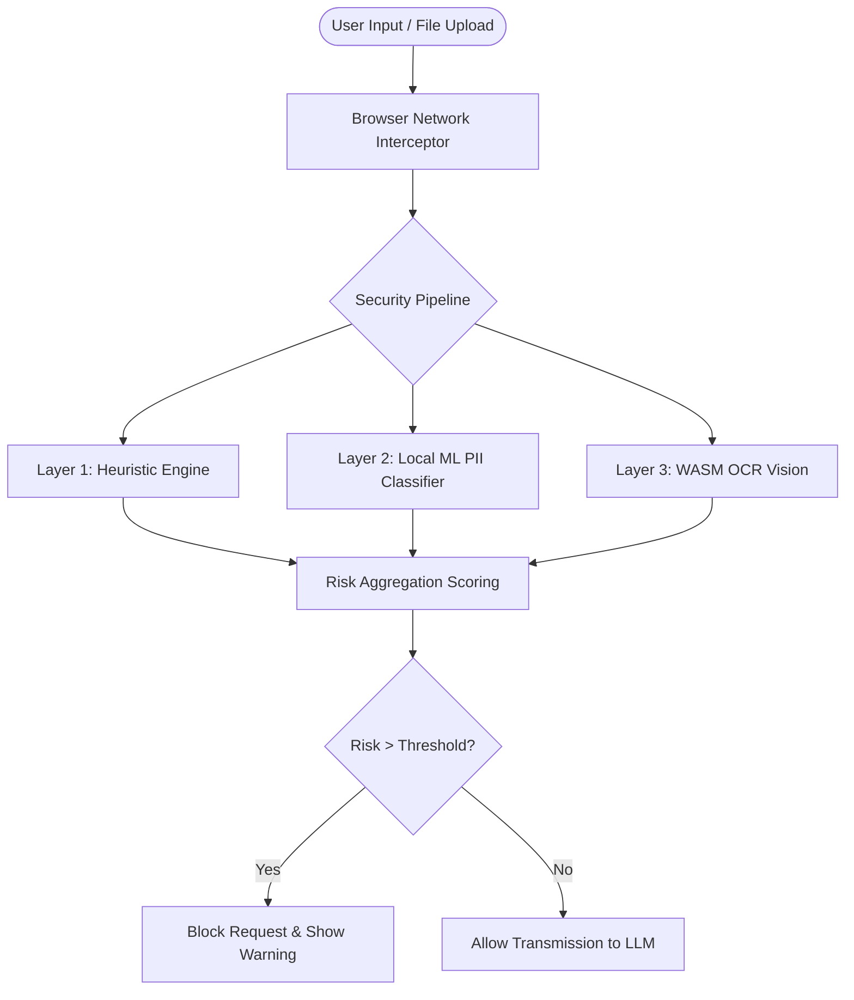

<div align="center">
  <h1> PrivacyGuard - AI Protector</h1>
  <p><strong>A Zero-Trust Browser Security Gateway Preventing PII & Corporate Data Exfiltration to LLMs</strong></p>

  <a href="https://privacyguardai.vercel.app/"><strong>Explore the Live Website »</strong></a>
  
  <br />
  <br />

  []()
  []()
  []()
</div>

---

## 🛑 The Problem
The rapid adoption of AI platforms (ChatGPT, Claude, Gemini) has created a massive shadow-IT security risk. Employees and individuals unknowingly upload **Highly Confidential Documents**, **API Keys**, **Aadhaar/PAN Cards**, and **Proprietary Source Code** to public LLMs, leading to severe data breaches and regulatory compliance violations.

##  The Solution: 
**Privacy Guard** is an enterprise-grade Chrome Extension operating entirely locally within the browser. It acts as an **air-gapped Zero-Trust gateway**, intercepting network requests and scanning text/file uploads in real-time before they ever leave the user's device.

If sensitive data is detected, Privacy Guard surgically blocks the request, explains the threat, and allows the user to redact the information—saving companies millions in potential breach liabilities.

---

##  Core Technical Architecture

Privacy Guard   isn't just a regex scanner; it's a multi-layered security engine built for speed and accuracy.



### 1.  Real-Time Network Interception
Injects deep into the DOM to intercept `fetch` and `XMLHttpRequest` events. Captures data milliseconds before it hits the network layer.

### 2.  Local Machine Learning Engine
Powered by a custom-trained TF-IDF vectorizer and Naive Bayes classifier running **entirely in the browser** via JavaScript. 
- Trained on a synthetic dataset of 10,000+ PII records.
- Detects contextual leaks that regex alone would miss.
- Zero latency; no external API calls required.

### 3.  WASM-Powered OCR for Images
Users often upload screenshots containing credentials. Privacy Guard   integrates **Tesseract.js** (compiled to WebAssembly) to locally extract text from `.png`, `.jpg`, and `.pdf` files, scanning the raw text for PAN cards, Aadhaar numbers, and financial data.

### 4.  Smart Auto-Discovery (1000+ Platforms)
Threats evolve daily. Privacy Guard   utilizes a background worker (`updater.js`) that synchronizes with a central threat feed every 24 hours. It dynamically maps new LLM platforms (e.g., when a new AI tool launches) without requiring a hard extension update.

---

##  What We Detect

| Category | Data Types Blocked |
|----------|-------------------|
| **Gov Identity** | Aadhaar, PAN Card, Voter ID, Passport, SSN, etc... |
| **Financial** | Credit Cards, CVV, Routing Numbers, Crypto Wallets, etc.. |
| **Corporate** | AWS/GCP API Keys, JWT Tokens, DB Connection Strings, etc.. |
| **Personal** | Email Addresses, Phone Numbers, IPv4 Addresses, etc... |

---

##  Supported Platforms

Currently actively guarding **1000+** domains including:
- **Core LLMs**: `chatgpt.com`, `claude.ai`, `gemini.google.com`, `aistudio.google.com`
- **Coding Assistants**: `github.com/copilot`, `cursor.com`
- **Productivity**: `notion.so`, `slack.com`
- *...and 900+ dynamically discovered AI endpoints.*

---

##  Installation for Hackathon Judges

To evaluate the complete security suite:

1. Clone or download this repository.
2. Open Google Chrome and navigate to `chrome://extensions/`.
3. Toggle **Developer mode** (top right corner).
4. Click **Load unpacked** and select the cloned repository folder.
5. Open [ChatGPT](https://chatgpt.com) and try typing an AWS Key (`AKIA...`) or uploading an image of an ID card.
6. Watch Privacy Guard   block the outbound request locally!

---

##  Repository Structure

```text
├── manifest.json       # V3 Extension Manifest
├── background.js       # Service worker for threat updates
├── content.js          # DOM injection & fetch interception
├── scanner.js          # Multi-layered regex + risk scoring
├── popup.html/.js      # Analytics UI dashboard
├── logs.html/.js       # Detailed threat violation logs
├── updater.js          # Dynamic URL threat fetcher
├── ml/
│   ├── data_generator.py   # Synthetic PII data generation
│   ├── train_pii.py        # ML training scripts
│   └── models/             # Exported JSON/Joblib models for JS inference
└── vendor/
    ├── tesseract/          # WASM OCR Engine
    └── pdfjs/              # Local PDF parsing
```

---


> *"Security shouldn't be an afterthought; it should be baked into the browser."*
